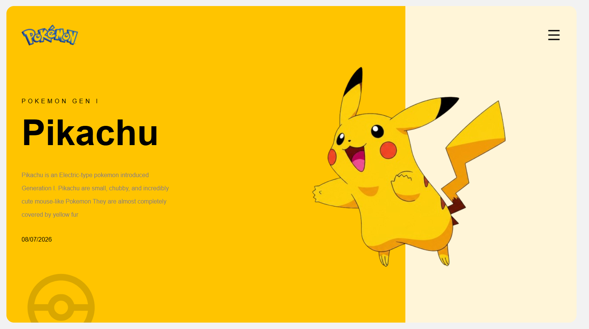

# ⚡ Pokemon Landing Page

A modern and responsive Pokémon landing page built using **HTML5** and **CSS3**. This project recreates a clean Pokémon-themed hero section with a stylish layout, gradient background, and positioned elements.

---

## 📸 Preview

> Add a screenshot of your project here.

Example:



---

## 🚀 Features

- 🎨 Modern Pokémon-inspired UI
- 📱 Responsive layout
- 🌈 Gradient background design
- 🖼️ Hero section with Pikachu
- 📍 CSS Position (Relative & Absolute)
- 📦 Flexbox layout
- ✨ Clean and organized code

---

## 🛠️ Built With

- HTML5
- CSS3
- Flexbox
- CSS Positioning
- Linear Gradient

---

## 📂 Project Structure

```
pokemon-landing-page/
│
├── image/
│   ├── Pokemon.png
│   ├── pikachu.png
│   ├── menu-line.png
│   └── watermark-pokemon.png
│
├── index.html
├── style.css
└── README.md
```

---

## 🎯 What I Practiced

- Semantic HTML
- Flexbox
- Position Relative & Absolute
- CSS Typography
- Gradient Background
- Image Positioning
- Layout Design
- CSS Spacing

---

## 💻 Getting Started

1. Clone the repository

```bash
git clone https://github.com/your-username/pokemon-landing-page.git
```

2. Open the project folder.

3. Open `index.html` in your browser.

---

## 📷 Screenshot

Add your project screenshot here.

---

## 🌟 Future Improvements

- Improve responsiveness for mobile devices
- Add animations
- Add hover effects
- Improve accessibility
- Optimize images

---

## 👨‍💻 Author

**Aminul Islam**

Frontend Developer | JavaScript Learner | Full Stack Developer in Progress

---

## ⭐ Support

If you like this project, consider giving it a ⭐ on GitHub.
